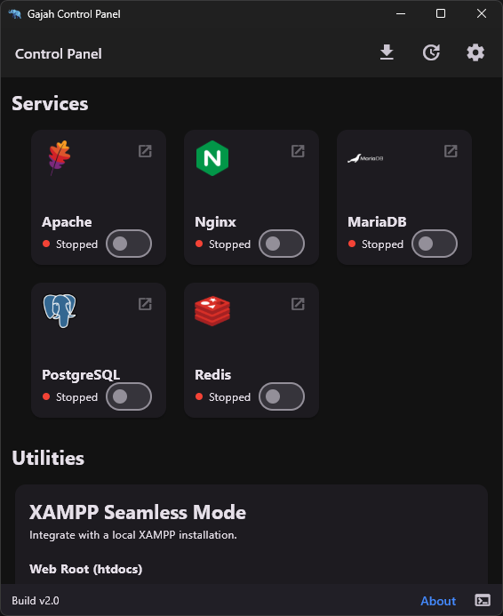

# Fitur Utama

Gajah Webserver hadir dengan berbagai fitur yang dirancang untuk menyederhanakan alur kerja pengembangan web Anda di Windows.

### Kontrol Layanan

Dengan Gajah Webserver, Anda dapat memulai dan menghentikan layanan web penting seperti Nginx, PHP-CGI, MariaDB, PostgreSQL, dan Redis hanya dengan satu klik. Aplikasi ini secara cerdas mendeteksi status setiap layanan (berjalan atau berhenti) dan port yang digunakannya, memberi Anda gambaran instan tentang lingkungan lokal Anda.

### Pengalih Versi PHP

Beralih di antara versi PHP yang berbeda tidak pernah semudah ini. Fitur Pengalih Versi PHP memungkinkan Anda untuk:
- Mengunduh versi PHP yang stabil atau arsip langsung dari API resmi.
- Mengatur versi PHP yang baru diunduh secara otomatis.
- Beralih di antara versi PHP yang terinstal dengan cepat.

### Konfigurasi Cepat

Akses dan ubah file konfigurasi penting tanpa harus mencarinya di File Explorer. Dari menu Pengaturan, Anda dapat:
- Mengubah port default untuk setiap layanan (Nginx, MariaDB, dll.).
- Membuka file `php.ini`, `nginx.conf`, dan `my.ini` langsung di editor teks default Anda.

### Terminal Terintegrasi

Pantau semua output dari layanan Anda secara real-time dalam satu tampilan terminal terpadu. Tidak perlu lagi membuka beberapa jendela command prompt. Terminal terintegrasi ini menampilkan log dari Nginx, PHP, dan layanan lainnya, membantu Anda men-debug aplikasi dengan lebih efisien.

### Mode Mulus XAMPP

Bagi Anda yang sudah memiliki instalasi XAMPP, fitur ini memungkinkan Anda untuk dengan mudah beralih direktori `htdocs` antara lingkungan Gajah Webserver (`C:\gajahweb\htdocs`) dan instalasi XAMPP Anda (`C:\xampp\htdocs`). Ini memungkinkan Anda untuk mengelola proyek yang ada di XAMPP menggunakan Gajah Webserver.

### Akses CLI Cepat

Untuk pengguna tingkat lanjut yang membutuhkan akses cepat ke antarmuka baris perintah, Gajah Webserver menyediakan pintasan untuk membuka:
- `psql`: Klien baris perintah PostgreSQL.
- `redis-cli`: Utilitas baris perintah Redis.

Semua alat baris perintah ini diluncurkan dengan konteks lingkungan yang benar, sehingga Anda tidak perlu mengatur variabel lingkungan secara manual.
