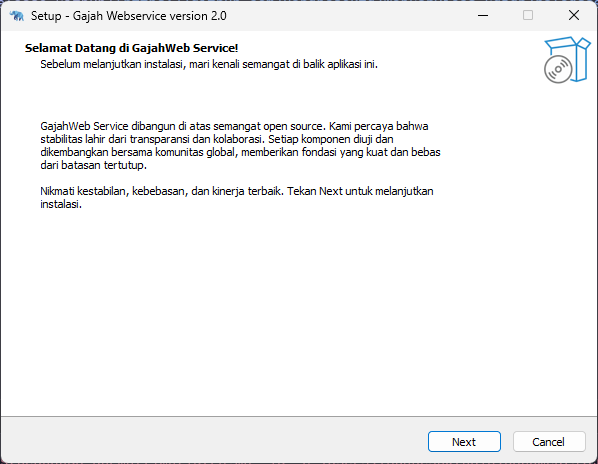
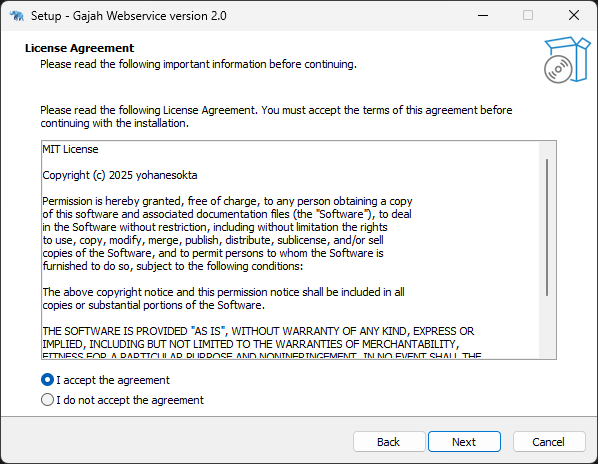
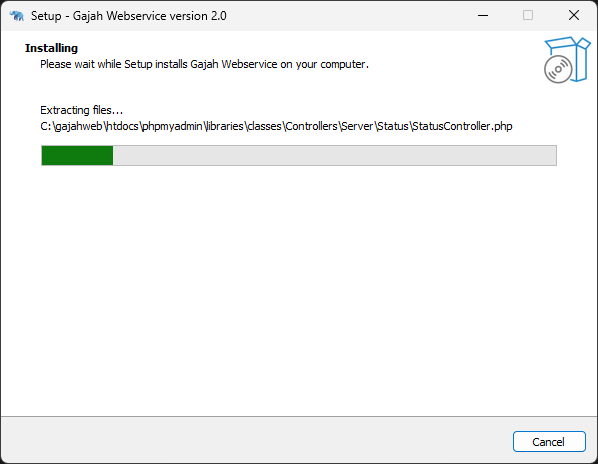

# Pra instalasi

Pada instalasi aplikasi gajahweb tidak terlalu berbeda pada instalasi pada software lainya. Pengguna dapat langsung mendownload dari [Halaman Download](/) ataupun melalui [Release Github](https://github.com/yohanesokta/WebServices-Gajah/releases)

### Pesan Sambutan
---

### Baca & Setujui Lisensi

Mengapa ini penting?, semua file dan program dalam aplikasi ini mempunyai lisensi masing - masing. Baca pahami agar tidak salah di kemudian hari.

---

### Lakukan Instalasi
---

